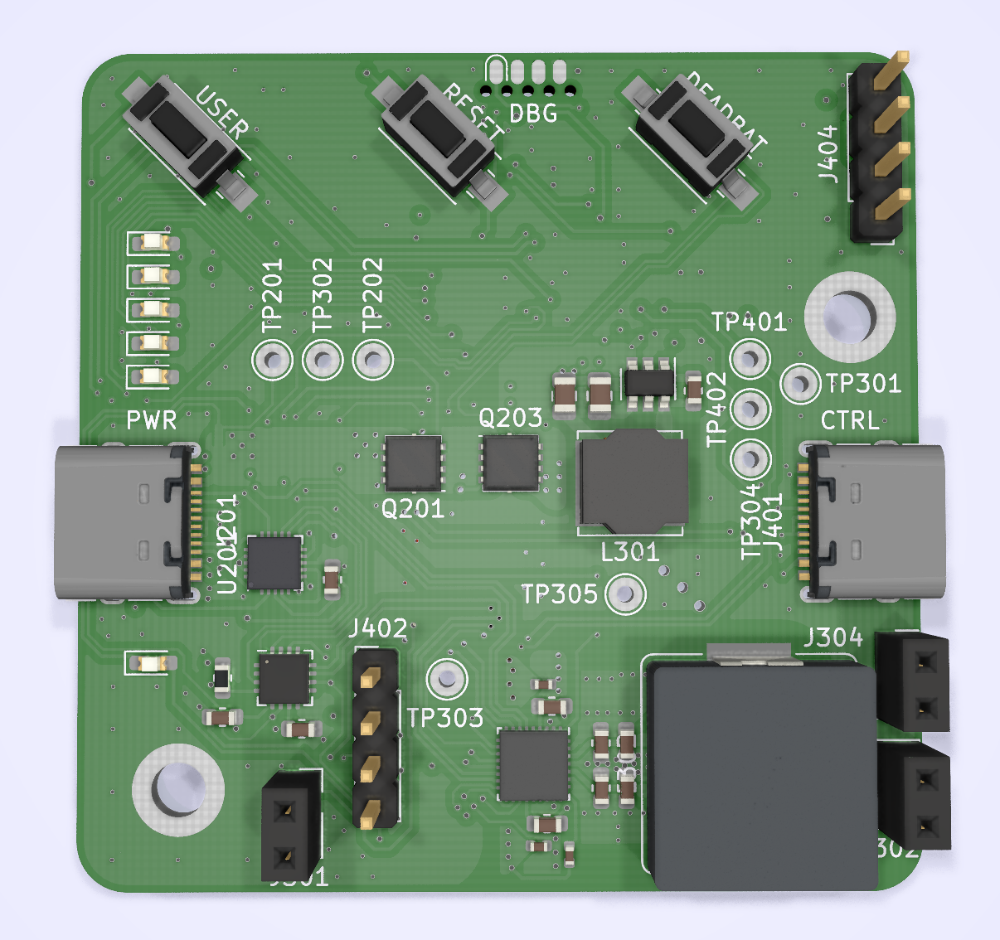

# Free-wheeling Ferret

USB-C Programmable Power Supply Source and Sink.

Back side optimized for JLCSMT, front for hand placing.

## Scattered Notes
Rough idea: Use the existing 10 boards to iron out firmware and get a good feel on the workings of USB-C PD. Then respin the boards, split the management functionality onto a separate board and make the Ferrets stackable.  

Ecosystem Idea:
 - Stackable Ferrets; you can have any\* amount of type C ports you can possibly need. Ferrets can have individual legacy electricity I/O, or can be tied to a single common bus. With the 
 - Configuration Board (top position only) you can monitor power flow and change port settings (source/sink, current and voltage) - this has a management interface (USB UART) and maybe Bluetooth/Wifi with an ESP32. Energy is stored in the
 - Battery Board; 4s BMS which can be attached to the bottom of a Ferret Stack. If you want to tie your Ferrets to a DC network with voltages usupported by the Ferret (so above 24V), you can just take an
 - Autobus; a 4-switch buck-boost converter with up to 60-V capability and hundreds of watts of power. This can easily interface with solar panels of larger size, 12-V lead-acid batteries, or 48-V grids. For cheaper, lower power connectivity you can use any additional stackable
 - Boost or Buck converter boards.

